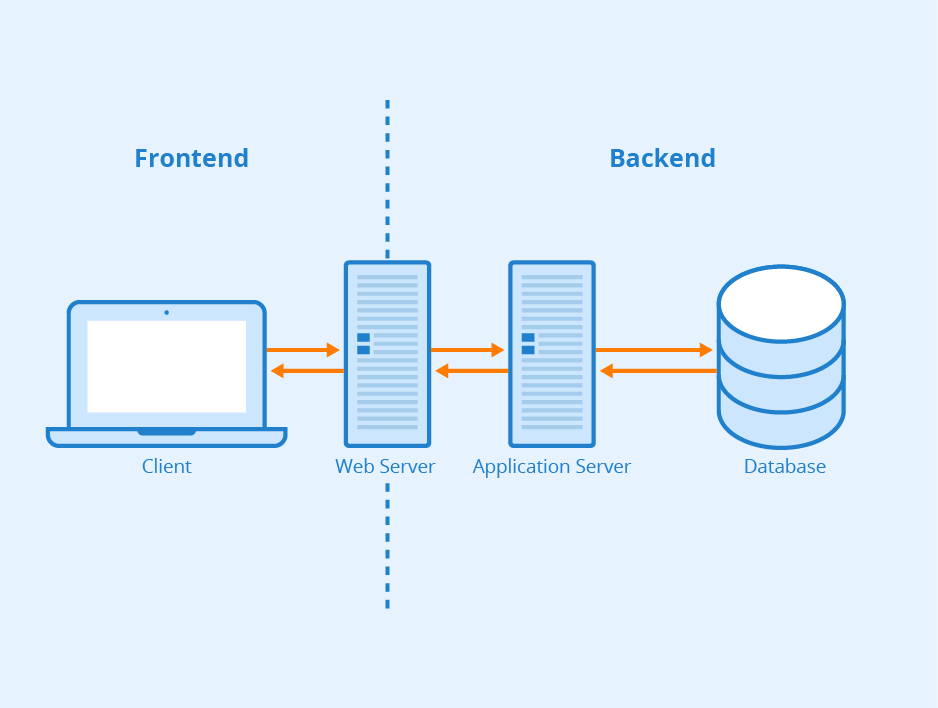

# to-do-list
Simple to-do list app to test different infrastructure configurations.

## The application
The system consists of three core components: a database, a application server, and a web server.

The frontend is powered by a web server, which hosts a React application. This component interacts seamlessly with the backend via APIs. On the backend, a Node.js application handles requests originating from the web server and facilitates communication with the database. The database itself is built on PostgreSQL for data management.

## The infrastructure

### Using AWS

- [Each component in a AWS EC2 Instance](infrastructure/AWS%20EC2)
- Web server and app server in containers managed by ECS and database in RDS
- Web server and app server in containers managed by EKS and database in RDS

### Using Azure

- Each component in Virtual Machines
- Web server and app server in containers managed by Azure Container Services and database in Azure PostgreSQL Server
- Web server and app server in containers managed by AKS and database in Azure PostgreSQL Server

## Some notes
- Esse repositório foi criado para estudo. Minha principal motivação para criá-lo foi para documentar trechos de códigos e facilitar a reutilização em outros projetos. 
- Como a intenção é documentar para reutilizar, poderei utilizar de diferentes ferramentas para criar os mesmos recursos. Dessa forma consigo deixar o repositório mais completo.
- O repositório ainda está sendo criado e tentarei mantê-lo sempre atualizado e com a documentação mais detalhada possível

## Meus links
- [LinkedIn](https://www.linkedin.com/in/phelipeavila/)